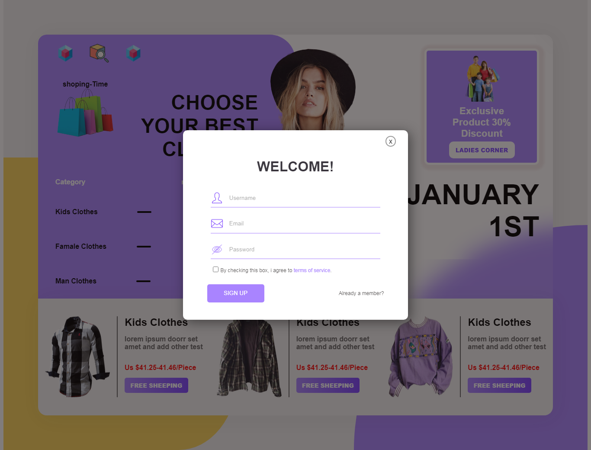
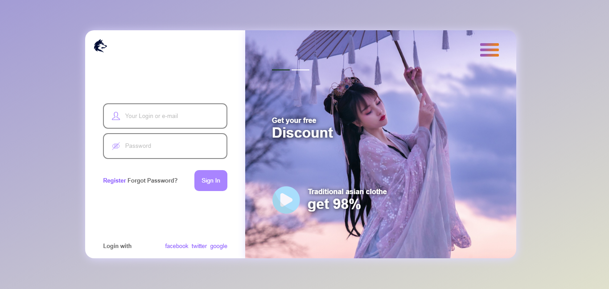
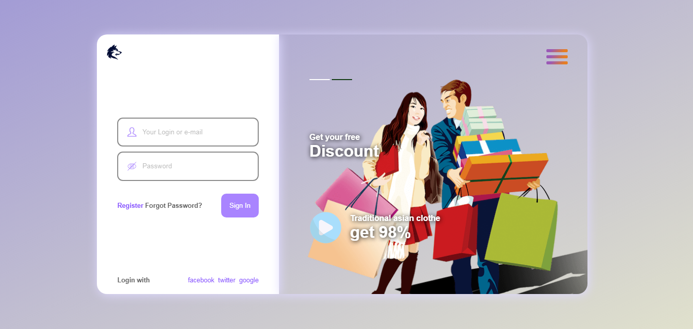

# simple shoping local web
## inspiration
  navbar from [ saluthdev](https://github.com/salluthdev/sidebar_menu) 
  design from[ Masud Rana](https://dribbble.com/shots/15374279-Clothing-Web-Design)
  form login from[ Bound](https://dribbble.com/shots/15583314-Log-in-page)
## demo
  [click here](https://dhyno.github.io/simple-shoping-local-web/)
  this is my first web practice with some of feature
## ppreview
  
   
    
     
